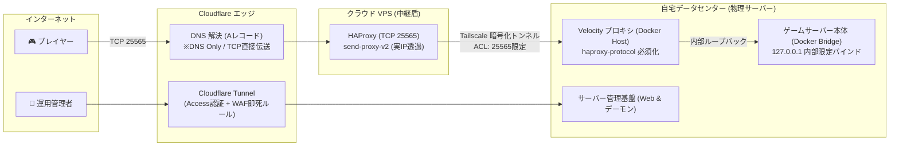

# oyu-server-infra 🌐

自宅オンプレミスサーバー、クラウド VPS（OCI Always Free）、および Cloudflare を連携させた、高セキュリティ・低遅延なゲームサーバー基盤を構築・管理するための Terraform（Infrastructure as Code）コードベースです。

---

## 🏛 アーキテクチャ概要

自宅のルーターポートを一切開放せず、パブリッククラウドの VPS とエッジセキュリティ（Cloudflare）を中継地点とすることで、自宅回線・プライベートネットワークの安全性を完全に保護した多層防御構成です。



---

## 🛠 技術スタック

- **IaC (構成管理)**: Terraform v1.16+ (HCL)
- **エッジ / DNS**: Cloudflare Provider v5 (`cloudflare_dns_record`)
- **クラウド中継**: Oracle Cloud Infrastructure (OCI Always Free VM)
- **オーバーレイネットワーク**: Tailscale (ゼロトラスト ACL & サブネット分離)
- **コンテナ / プロキシ**: Docker, HAProxy (PROXY Protocol v2), Velocity

---

## 📁 ディレクトリ構成

```text
.
├── .gitignore               # 機密情報（state, tfvars, .env 等）の完全除外
├── .terraform.lock.hcl      # プロバイダ依存関係のロック（再現性の担保）
├── versions.tf              # Terraform 本体および Cloudflare Provider v5 のバージョン定義
├── variables.tf             # 汎用的な入力変数の型宣言と説明
├── terraform.tfvars.example # 公開用サンプル設定ファイル（ダミー値）
├── cloudflare.tf            # DNS レコード定義および宣言的 import ブロック
└── README.md                # 本ドキュメント（システム解説）
```

---

## 🔒 セキュリティ・秘匿情報の防衛設計（Public リポジトリ前提）

1. **機密情報の完全隔離**:
   - `terraform.tfstate`（状態台帳ファイル）および `*.tfvars`（実設定値ファイル）は `.gitignore` により Git の追跡から徹底的に除外されています。
   - API トークンはコード内に一切記述せず、環境変数（`CLOUDFLARE_API_TOKEN`）から自動読み込みを行います。
2. **既存環境の無停止（ノーダウン）移行**:
   - Terraform 1.5+ の宣言的 `import {}` ブロックを採用し、稼働中の本番サービスを停止させることなく、コード管理下へと安全に状態収束させます。
3. **ビルド再現性の保証**:
   - `.terraform.lock.hcl` を Git 管理下に置くことで、どの環境で実行しても同一バージョンのプロバイダバイナリが検証・使用される設計としています。

---

## 🚀 セットアップ手順

### 前提条件
- Terraform >= 1.5.0
- Cloudflare API トークン（権限: `Zone - DNS - Edit` または `Read`）

### 実行手順

1. **リポジトリのクローン**:
   ```bash
   git clone git@github.com:yuz145/oyu-server-infra.git
   cd oyu-server-infra
   ```

2. **API トークンの環境変数設定**:
   ```bash
   export CLOUDFLARE_API_TOKEN="あなたのAPIトークン"
   ```

3. **ローカル設定ファイルの作成**:
   サンプルファイルをコピーし、実際の環境に合わせて値を入力します（このファイルは Git にコミットされません）。
   ```bash
   cp terraform.tfvars.example terraform.tfvars
   # terraform.tfvars を編集して実際の ID や IP アドレスを記述
   ```

4. **Terraform の初期化と適用**:
   ```bash
   # プロバイダの初期化
   terraform init

   # 実行計画の確認
   terraform plan

   # 構成の適用
   terraform apply
   ```

---

## 📄 ライセンス

MIT License
