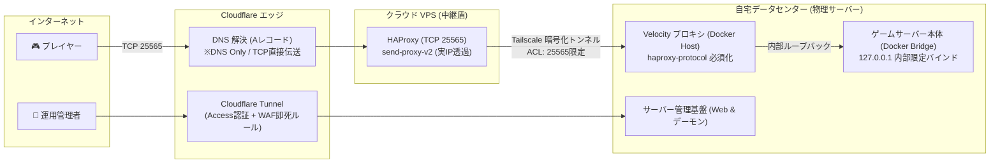

# oyu-server-infra 🌐

自宅オンプレミスサーバー、クラウド VPS（OCI Always Free）、および Cloudflare を連携させた、高セキュリティ・低遅延なゲームサーバー基盤を構築・管理するための Terraform（Infrastructure as Code）コードベースです。

本リポジトリは **「ローカルに一切のシークレットファイルを残さない（Zero Local Secrets）」** という大企業水準のセキュリティ思想に基づき、シークレットマネージャー（**Infisical**）による実行時オンメモリ動的注入を前提として設計されています。

---

## 🏛 アーキテクチャ概要

自宅のルーターポートを一切開放せず、パブリッククラウドの VPS とエッジセキュリティ（Cloudflare）を中継地点とすることで、自宅回線・プライベートネットワークの安全性を完全に保護した多層防御構成です。



---

## 🛠 技術スタック

- **IaC (構成管理)**: Terraform v1.16+ (HCL)
- **シークレット管理**: Infisical (実行時オンメモリ動的注入)
- **エッジ / DNS**: Cloudflare Provider v5 (`cloudflare_dns_record`)
- **クラウド中継**: Oracle Cloud Infrastructure (OCI Always Free VM)
- **オーバーレイネットワーク**: Tailscale (ゼロトラスト ACL & サブネット分離)
- **コンテナ / プロキシ**: Docker, HAProxy (PROXY Protocol v2), Velocity

---

## 📁 ディレクトリ構成

```text
.
├── .gitignore               # 機密情報（state, tfvars, .env 等）の完全除外
├── .terraform.lock.hcl      # プロバイダ依存関係のロック（再現性の担保）
├── versions.tf              # Terraform 本体、Cloudflare / OCI プロバイダ定義
├── variables.tf             # 必要な全変数の型宣言・ドキュメント定義（変数の仕様書）
├── cloudflare.tf            # 宣言的 import ブロック & play DNSレコード定義
├── oci.tf                   # 宣言的 import ブロック & VCN デフォルトセキュリティリスト定義
└── README.md                # 本ドキュメント（システム解説）
```

> [!NOTE]
> **なぜ `terraform.tfvars.example` が存在しないのか？**  
> 本リポジトリはシークレットマネージャー（Infisical）によるメモリ注入を前提としており、手元に `*.tfvars` ファイルを 1 枚も作成しないアーキテクチャを採用しています。必要な変数の仕様（型や説明）はすべて [`variables.tf`](variables.tf) に宣言されています。

---

## 🔒 セキュリティ・秘匿情報の防衛設計（Public リポジトリ前提）

1. **ゼロ・ローカルファイル運用 (Infisical 動的注入)**:
   - 手元に `*.tfvars` やクレデンシャルファイルを作成しません。API トークンや秘密鍵は Infisical 上で一元管理され、Terraform 実行時にメモリ上へ直接 `TF_VAR_*` として注入されます。
2. **既存環境の無停止（ノーダウン）移行**:
   - Terraform 1.5+ の宣言的 `import {}` ブロックを採用し、稼働中の本番サービスを停止させることなく、コード管理下へと安全に状態収束させます。
3. **ビルド再現性の保証**:
   - `.terraform.lock.hcl` を Git 管理下に置くことで、どの環境で実行しても同一バージョンのプロバイダバイナリが検証・使用される設計としています。

---

## 🚀 セットアップ ＆ 実行手順

### 前提条件
- Terraform >= 1.5.0
- Infisical CLI

### 実行手順

1. **リポジトリのクローン**:
   ```bash
   git clone git@github.com:yuz145/oyu-server-infra.git
   cd oyu-server-infra
   ```

2. **Infisical CLI のインストール**:
   ```bash
   brew install infisical/get-cli/infisical
   ```

3. **Infisical へのログインとプロジェクト接続**:
   ```bash
   infisical login
   infisical init
   ```
   ※ [`variables.tf`](variables.tf) に定義された各変数を、Infisical ダッシュボードに `TF_VAR_<変数名>` の形式で登録します。

4. **オンメモリ動的注入による実行**:
   ローカルに設定ファイルを生成せず、Infisical 経由で安全に実行します：
   ```bash
   # プロバイダの初期化
   infisical run -- terraform init

   # 実行計画の確認 (メモリ注入)
   infisical run -- terraform plan

   # 構成の適用 (メモリ注入)
   infisical run -- terraform apply
   ```

---

## 📄 ライセンス

MIT License
